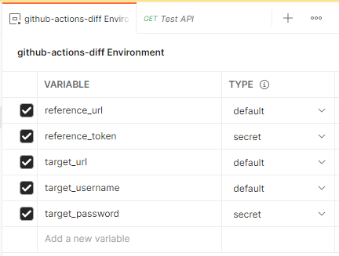
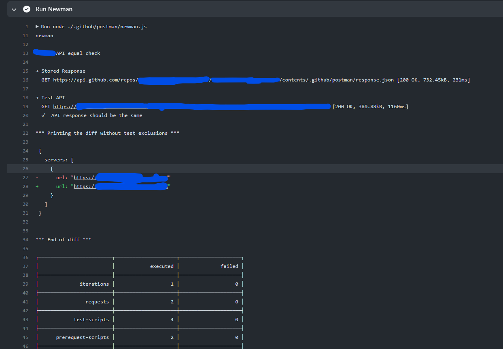

# Newman runner & JSON diff

## Purpose
This GitHub Action workflow allows you to;
* Run a specific Postman Collection in an automated pipeline through newman. Can use authentication through a GITHUB_TOKEN when getting the collection.
* Load (JSON) data from a `base_url` with Basic Auth authentication.
* Test the specified `target_url` (JSON), also with Basic Auth authentication (user/password).

The workflow will fail (exit 1) if the Postman run fails (which is easy to test/verify locally).
The workflow succeeds if Postman executes successfully, printing the report both on cli and generating a richer html report on `/newman`.
## How to use
### GitHub Actions
You can include this workflow through the `uses` keyword in a GitHub Actions workflow:

```javascript
jobs:
  API-test:
    runs-on: ubuntu-latest
    steps:
      - name: Checkout
        uses: actions/checkout@v3
      - name: Run Newman
        uses: EnergyExchangeEnablersBV/github-actions-diff@v2
        env:
          GITHUB_TOKEN: ${{ secrets.GITHUB_TOKEN }}
        with:
            collection_organization: ${{ github.event.inputs.collection_organization }}
            collection_repository: ${{ github.event.inputs.collection_repository }}
            collection_path: ${{ github.event.inputs.collection_path }}
            collection_git_ref: ${{ github.event.inputs.collection_git_ref }}
            target_url: ${{ github.event.inputs.target_url }}
            target_username: ${{ github.event.inputs.target_username }}
            target_password: ${{ github.event.inputs.target_password }}
            base_url: ${{ github.event.inputs.base_url }}
            base_username: ${{ github.event.inputs.base_username }}
            base_password: ${{ github.event.inputs.base_password }}
```

In the above example, most information is provided through `input` on a manual workflow_dispatch job, however you can also directly provide these in code.
The following environment variables are used internally:
```shell
INPUT_COLLECTION_ORGANIZATION   # The GitHub Organization where the Postman Collection resides (e.g. octocat).
INPUT_COLLECTION_REPOSITORY     # The GitHub Repository where the Postman Collection resides (e.g. myrepo).
INPUT_COLLECTION_PATH           # The GitHub Path where the Postman Collection resides (e.g. myPostmanCollection.json).
INPUT_COLLECTION_GIT_REF        # The git ref (branch) where the Postman collection JSON resides (defaults to 'master').
INPUT_REFERENCE_URL             # The full reference URL which can be used for testing in Postman & diff, e.g. https://api.github.com/repos/octocat/hello-world/contents/README.md.
INPUT_BASE_URL                  # Base URL, typically your stable live application (e.g. https://myprdapp.mydomain.com/api-docs). 
INPUT_BASE_USERNAME             # Base basic auth username.
INPUT_BASE_PASSWORD             # Base basic auth password.
INPUT_TARGET_URL                # Target URL, typically your live tested application (e.g. https://myapp.mydomain.com/api-docs). 
INPUT_TARGET_USERNAME           # Target basic auth username.
INPUT_TARGET_PASSWORD           # Target basic auth password.
GITHUB_TOKEN                    # Secret used for authentication, to obtain the Postman Collection.
```

A report should be made in the directory `/newman`, which you can save using a separate step:
```
jobs:
  steps:
    - name: Store Newman html report
      uses: actions/upload-artifact@v3
      if: always()
      with:
        name: newman-report
        path: newman/*
```

### Postman
In line with the variables listed above, these are the variables you will typically use in Postman:


The GHA converts all environment variables by stripping `INPUT_` and passing it onwards to newman (which is equal to Postman environment).  
Except for `reference_token`, which will be populated by the `GITHUB_TOKEN` in the GHA workflow. For local Postman use, it is recommended to use a GitHub PAT (Personal Access Token) having at least `repo` permissions.

## Screenshots
The run itself prints only a few lines, but a report looks like this: 
