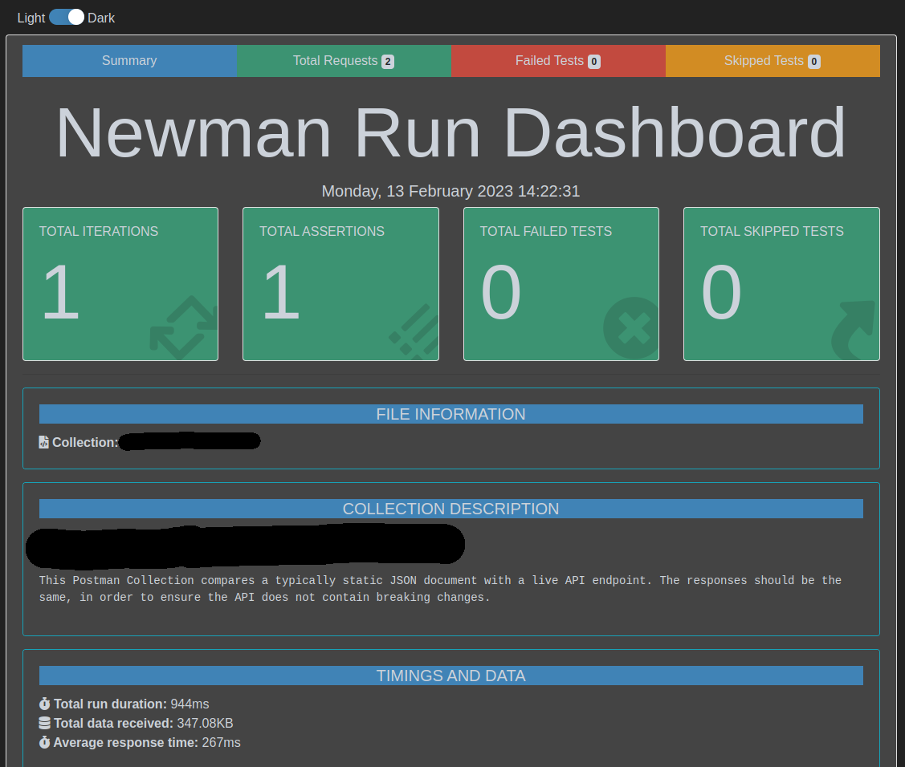

# Newman runner & JSON diff


## Purpose
This GitHub Action workflow allows you to;
* Run a specific Postman Collection in an automated pipeline through newman
* Load (JSON) data from a `reference_url` including authentication (through Authorization header) with the `GITHUB_TOKEN`.
* Test the specified `target_url` (JSON) with Basic Auth authentication (user/password).
* Show a JSON Diff between the `reference_url` and `target_url`.

The workflow will fail (exit 1) if the Postman run fails (which is easy to test/verify locally).
The workflow succeeds if Postman executes successfully, additionally printing the JSON diff (for convenience).
## How to use
### GitHub Actions
You can include this workflow through the `uses` keyword in a GitHub Actions workflow:

```javascript
jobs:
  API-test:
    runs-on: ubuntu-latest
    steps:
      - name: Checkout
        uses: actions/checkout@v3
      - name: Run Newman
        uses: EnergyExchangeEnablersBV/github-actions-diff@v1
        env:
          GITHUB_TOKEN: ${{ secrets.GITHUB_TOKEN }}
        with:
          collection_organization: ${{ github.event.inputs.collection_organization }}
          collection_repository: ${{ github.event.inputs.collection_repository }}
          collection_path: ${{ github.event.inputs.collection_path }}
          reference_url: ${{ github.event.inputs.reference_url }}
          target_url: ${{ github.event.inputs.target_url }}
          target_username: ${{ github.event.inputs.target_username }}
          target_password: ${{ github.event.inputs.target_password }}
```

In the above example, most information is provided through `input` on a manual workflow_dispatch job, however you can also directly provide these in code.
The following environment variables are used internally:
```shell
INPUT_COLLECTION_ORGANIZATION   # The GitHub Organization where the Postman Collection resides (e.g. octocat).
INPUT_COLLECTION_REPOSITORY     # The GitHub Repository where the Postman Collection resides (e.g. myrepo).
INPUT_COLLECTION_PATH           # The GitHub Path where the Postman Collection resides (e.g. myPostmanCollection.json). 
INPUT_REFERENCE_URL             # The full reference URL which can be used for testing in Postman & diff, e.g. https://api.github.com/repos/octocat/hello-world/contents/README.md.
INPUT_TARGET_URL                # Target URL, typically your live application (e.g. https://myapp.mydomain.com/api-docs). 
INPUT_TARGET_USERNAME           # Target basic auth username.
INPUT_TARGET_PASSWORD           # Target basic auth password.
GITHUB_TOKEN                    # Secret used for authentication, to obtain both the Postman Collection and the Reference URL.
```
### Postman
In line with the variables listed above, these are the variables you can use in Postman:


Note that `reference_token` will be the `GITHUB_TOKEN` in the workflow, however for personal testing it is recommended to use a GitHub PAT (Personal Access Token).

## Screenshots
An impression of how this could show up in your workflow:
